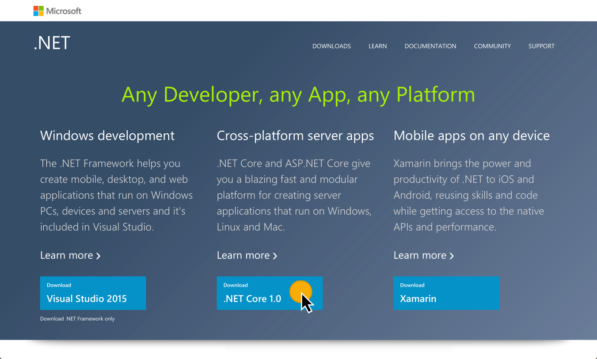
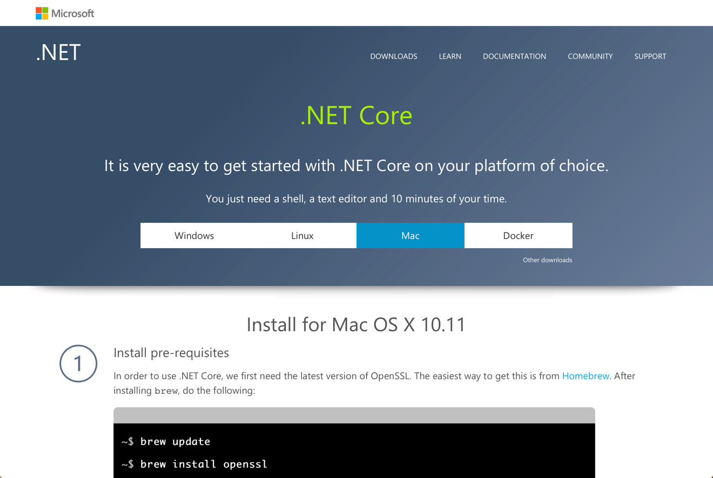

# Configurando el ambiente

Antes de arrancar, necesitamos tener las herramientas instaladas.

## .NET Core

A la hora de ejecutar ASP.NET Core podemos elegir usarlo con el clásico framework de .NET o con .NET Core. En este workshop vamos a usar el segundo, dado que nos permite ejecutar nuestras aplicaciones en la plataforma que quieran.

1. Navegar a [https://get.asp.net/](https://get.asp.net/).

1. Una vez en el sitio, seleccionar la opción **Download .NET Core**.

    

    _Descargando .NET Core_

1. La plataforma en la cual se está ejecutando debería aparecer seleccionada dentro de las posibilidades, caso contrario seleccionarla y seguir los pasos para instalar.

    > **Nota 1**: En el caso de Windows, instalar el **.NET Core SDK for Windows** que permite desarrollar sin Visual Studio.

    > **Nota 2**: No es necesario hacer los pasos una vez instalado (los que de la sección llamada _Initialize some code_), dado que estos pasos se realizaran como parte de uno de los módulos.

    

    _Siguiendo los pasos para instalar .NET Core_

## Visual Studio Code

Para editar el código vamos a aprovechar Visual Studio Code, en especial porque nos permite trabajar en todas las plataformas. Igualmente, se puede usar su editor de texto preferido.

1. Navegar a [https://code.visualstudio.com](https://code.visualstudio.com) y descargar la versión correspondiente para tu plataforma.

    

    _Sitio de Visual Studio Code_

1. Una vez descargado, seguir los pasos de la instalación.

## Node.js & npm

A la hora de crear aplicaciones con Angular 2, necesitamos tener instalado node.js y npm. El primero nos va a servir para poder correr las herramientas necesarias. El segundo, lo necesitamos dado que es la forma en la se distribuye los paquetes.

> **Nota**: Verificar que tenes instalado al menos la versión 4.x.x de node.js y la versión 3.x.x de npm corriendo `node -v` y `npm -v` en la terminal/consola.

1. Navegar al sitio de descargas de node.js [https://nodejs.org/es/download/](https://nodejs.org/es/download/).

1. Seleccionar la versión LTS (Long term support) y la plataforma correspondiente.

1. Una vez descargado, seguir los pasos de la instalación.
