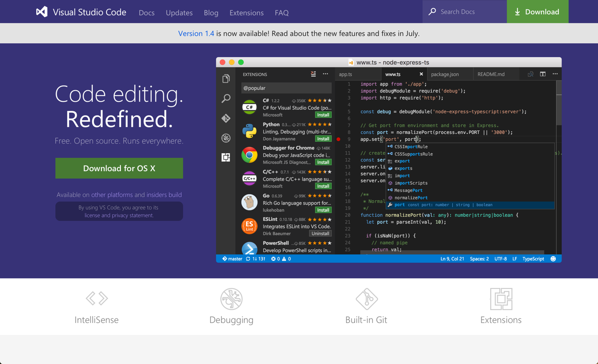

# Configurando el ambiente

Antes de arrancar, se necesitan tener las herramientas instaladas. No hay restricciones con respecto al sistema operativo (_Windows, Linux o Mac_) y al browser (_Microsoft Edge, Chrome, Safari, Firefox, etc._). 

Se requiere instalar _ASP.NET Core_, _node.js_ y _npm_. Aparte de estas herramientas, se necesita un editor de texto (_Visual Studio Code, Sublime, Atom, Vim, etc._). 

A continuación se explica como instalar alguna de ellas.

> **Nota**: Para alguna de las herramientas pueden existir dependencias adicionales como es el caso de _brew_ para instalar _.NET Core_ en _Mac_.

## .NET Core

A la hora de ejecutar _ASP.NET Core_ podemos elegir usarlo con el clásico framework de _.NET_ o con _.NET Core_. En este workshop se usará el segundo, dado que permite ejecutar las aplicaciones en cualquier plataforma.

1. Navegar a [https://get.asp.net/](https://get.asp.net/).

1. Una vez en el sitio, seleccionar la opción **Download .NET Core**.

    

    _Descargando .NET Core_

1. La plataforma en la cual se está ejecutando debería aparecer seleccionada dentro de las posibilidades, caso contrario seleccionarla y seguir los pasos para instalar.

    > **Nota 1**: En el caso de _Windows_, instalar el **.NET Core SDK for Windows** que permite desarrollar sin _Visual Studio_.

    > **Nota 2**: No es necesario hacer los pasos una vez instalado (los que de la sección llamada _Initialize some code_), dado que estos pasos se realizaran como parte de uno de los módulos.

    

    _Siguiendo los pasos para instalar .NET Core_

## Visual Studio Code

Para editar el código, se va a aprovechar _Visual Studio Code_, en especial porque permite trabajar en todas las plataformas al igual que _.NET Core_. Igualmente, se puede usar su editor de texto preferido.

1. Navegar a [https://code.visualstudio.com](https://code.visualstudio.com) y descargar la versión correspondiente para tu plataforma.

    

    _Sitio de Visual Studio Code_

1. Una vez descargado, seguir los pasos de la instalación.

1. Aparte de _Visual Studio Code_, se recomienda instalar la [extensión de C#](https://marketplace.visualstudio.com/items?itemName=ms-vscode.csharp).

## Node.js & npm

A la hora de crear aplicaciones con _Angular 2_, se necesita tener instalado [node.js](https://nodejs.org) y [npm](https://www.npmjs.com). El primero sirve para poder correr las herramientas necesarias. El segundo, se necesita dado que es la forma en la se distribuye los paquetes.

> **Nota**: Verificar que está instalada al menos la versión _4.x.x_ de _node.js_ y la versión _3.x.x_ de _npm_ corriendo `node -v` y `npm -v` en la terminal/consola.

1. Navegar al sitio de descargas de _node.js_: [https://nodejs.org/es/download/](https://nodejs.org/es/download/).

1. Seleccionar la versión _LTS (Long term support)_ y la plataforma correspondiente.

1. Una vez descargado, seguir los pasos de la instalación.

## Conclusiones

Con este tipo de herramientas se puede desarrollar desde cualquier plataforma (Windows, Mac o Linux) sin ningún problema, permitiendo una mayor flexibilidad.

Ahora que el entorno de desarrollo esta listo, no queda otra cosa que empezar a desarrollar las aplicaciones.