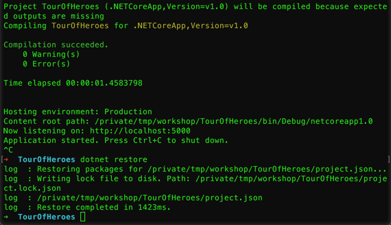
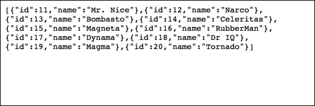

# Creando una API REST con ASP.NET Core

[ASP.NET Core](http://www.asp.net/core) es una nuevo framework web, open-source ([GitHub](https://github.com/aspnet)) y multiplataforma pensado para crear aplicaciones web modernas, con foco en aprovechar la nube así como en solucionar algunos de los nuevos desafíos como _IoT (Internet of Things)_ y backends para aplicaciones móviles.

Algo interesante a tener en cuenta es que _ASP.NET Core_ puede correr sobre [.NET Core](https://www.microsoft.com/net/core/platform) o sobre el [clásico .NET framework](https://www.microsoft.com/net/framework).

En este módulo se verá como crear una _API REST_ de cero usando _.NET Core_.

## Tarea 1: Creando la aplicación base

1. Crear una nueva carpeta para trabajar y abrir una terminal/consola en ese directorio. 

1. Luego, ejecutar el siguiente comando para crear una aplicación base.

    ```
    dotnet new
    ```

    

    _Ejecutando dotnet new_

1. Una vez creada la aplicación, abrir el _project.json_ y agregar la siguiente línea dentro de las dependencias, para agregar el server _HTTP_.

    ```json
    "Microsoft.AspNetCore.Server.Kestrel": "1.0.0"
    ```

    > **Nota**: El contenido del _project.json_ en este punto debería quedar similar al siguiente:
    > 
    > ```json    
    > {
    >   "version": "1.0.0-*",
    >   "buildOptions": {
    >     "debugType": "portable",
    >     "emitEntryPoint": true
    >   },
    >   "dependencies": {
    >     "Microsoft.AspNetCore.Server.Kestrel": "1.0.0"
    >   },
    >   "frameworks": {
    >     "netcoreapp1.0": {
    >       "dependencies": {
    >         "Microsoft.NETCore.App": {
    >           "type": "platform",
    >           "version": "1.0.0"
    >         }
    >       },
    >       "imports": "dnxcore50"
    >     }
    >   }
    > }
    > ```


1. Ahora, hay que instalar localmente los paquetes, para esto ejecutamos la siguiente línea.

    ```
    dotnet restore
    ```

    

    _Ejecutando dotnet restore_

    > **Nota**: Al realizar esta tarea, se creará un nuevo archivo _project.lock.json_.

1. Luego de que termine de instalar todos las dependencias, vamos a crear un nuevo archivo llamado _Startup.cs_ y agregamos el siguiente contenido.

    ```csharp
    using Microsoft.AspNetCore.Builder;
    using Microsoft.AspNetCore.Hosting;
    using Microsoft.AspNetCore.Http;

    namespace TourOfHeroes
    {
      public class Startup
      {
        public void Configure(IApplicationBuilder app)
        {
          app.Run(context =>
          {
            return context.Response.WriteAsync("Hello from ASP.NET Core!");
          });
        }
      }
    }
    ```

    > **Nota**: Cambiar el _namespace_ si es necesario/preferido. Tener en cuenta en cambiarlo en todos los archivos que se crearán a continuación.

1. Ahora es momento de actualizar el _Program.cs_ para hacer que ejecute el _web host_. Para esto, usamos el siguiente código.

    ```csharp
    using Microsoft.AspNetCore.Hosting;

    namespace TourOfHeroes
    {
      public class Program
      {
        public static void Main(string[] args)
        {
          var host = new WebHostBuilder()
            .UseKestrel()
            .UseStartup<Startup>()
            .Build();
            
          host.Run();
        }
      }
    }
    ```

    > **Nota**: Es interesante notar que estamos corriendo una aplicación de consola que instancia el _WebHostBuilder_ y usando una fluent API, configura y corre el _Web Server_. 

1. Para probar que todo ande correctamente hasta este punto, ejecutar el siguiente comando.

    ```
    dotnet run
    ```

    
    
    _Corriendo la aplicación_

1. Luego, navegar en el browser a [http://localhost:5000](http://localhost:5000). Con esto se mostrará un “Hello World” en el browser.

    

    _Mensaje de Hello World_

1. Terminar la aplicación con **Ctrl + C**.

## Tarea 2: Agregando logging y configuraciones

A la hora de crear aplicaciones, resulta muy útil poder saber que pasa y si hay errores. Aparte de esto, el tipo de información que nos interesa cambia según el momento y el entorno donde nos encontramos. 

Para esto en los siguientes pasos se configurará _logging_, como también el manejo de configuraciones desde diferentes fuentes.

1. Abrir el _project.json_ y agregar las siguientes dependencias.

    ```json
    "Microsoft.Extensions.Configuration.EnvironmentVariables": "1.0.0",
    "Microsoft.Extensions.Configuration.Json": "1.0.0",
    "Microsoft.Extensions.Configuration.CommandLine": "1.0.0",
    "Microsoft.Extensions.Logging": "1.0.0",
    "Microsoft.Extensions.Logging.Console": "1.0.0",
    "Microsoft.Extensions.Logging.Debug": "1.0.0"
    ```

1. Ejecutar en la terminal `dotnet restore` para actualizar las dependencias y el _project.lock.json_.

    

    _Ejecutando dotnet restore nuevamente_

1. Ahora, abrir el _Program.cs_ y actualizar el contenido para pasarle las configuraciones al _WebHostBuilder_.

    ```csharp
    using System.IO;
    using Microsoft.AspNetCore.Hosting;
    using Microsoft.Extensions.Configuration;

    namespace TourOfHeroes
    {
      public class Program
      {
        public static void Main(string[] args)
        {
          var config = new ConfigurationBuilder()
                    .AddCommandLine(args)
                    .AddEnvironmentVariables(prefix: "ASPNETCORE_")
                    .Build();

          var host = new WebHostBuilder()
              .UseConfiguration(config)
              .UseKestrel()
              .UseContentRoot(Directory.GetCurrentDirectory())
              .UseStartup<Startup>()
              .Build();

          host.Run();
        }
      }
    }
    ```

1. Luego, abrir el _Startup.cs_ y actualizar el contenido por el siguiente.

    ```csharp
    using Microsoft.AspNetCore.Builder;
    using Microsoft.AspNetCore.Hosting;
    using Microsoft.AspNetCore.Http;
    using Microsoft.Extensions.Configuration;
    using Microsoft.Extensions.Logging;

    namespace TourOfHeroes
    {
      public class Startup
      {
        public Startup(IHostingEnvironment env)
        {
          var builder = new ConfigurationBuilder()
            .SetBasePath(env.ContentRootPath)
            .AddJsonFile("appsettings.json", optional: true, reloadOnChange: true)
            .AddJsonFile($"appsettings.{env.EnvironmentName}.json", optional: true)
            .AddEnvironmentVariables();
            
          Configuration = builder.Build();
        }

        public IConfigurationRoot Configuration { get; }

        public void Configure(IApplicationBuilder app, IHostingEnvironment env, ILoggerFactory loggerFactory)
        {
          loggerFactory.AddConsole(Configuration.GetSection("Logging"));
          loggerFactory.AddDebug();
          
          var logger = loggerFactory.CreateLogger("Catchall Endpoint");
          app.Run(context =>
          {
            logger.LogInformation("New request to: {path}", context.Request.Path);

            return context.Response.WriteAsync("Hello from ASP.NET Core!");
          });
        }
      }
    }
    ```

    > **Nota**: Este código agrega lo siguiente:
    >
    > - **Constructor**: recibe una variable con la información del entorno y crea una configuración sumando el archivo _appsettings.json_ y las variables de entorno.
    > - **Configuration**: esta propiedad tiene toda la configuración de las diferentes fuentes usadas en el constructor.
    > - **Método Configure**: en este método se agrega la configuración del _loggerFactory_ y se crea una instancia que se utiliza ante cada request.

1. Agregar el archivo _appsettings.json_ con las configuraciones para _logging_.

    ```json
    {
      "Logging": {
        "IncludeScopes": false,
        "LogLevel": {
          "Default": "Debug",
          "System": "Information",
          "Microsoft": "Information"
        }
      }
    }
    ```

1. Para comprobar que todo esté bien, ejecutar nuevamente la aplicación.

    ```
    dotnet run
    ```

    

    _Corriendo la aplicación con logging_

1. Navegar en el browser a [http://localhost:5000](http://localhost:5000), que mostrará el mismo mensaje, pero esta vez en la terminal tendremos más información.

    

    _Los mensajes en la terminal_

1. Terminar la aplicación con **Ctrl + C**.

## Tarea 3: Creando la API REST

A la hora de crear una _API REST_, vamos a usar [MVC](https://github.com/aspnet/Mvc). En el pasado, existía _Web API_ como algo separado de _MVC_, pero en la nueva versión se unificó.

1. Para agregar la dependencia, abrir el _project.json_ y agregar la siguiente línea dentro de las dependencias, debajo de la que agregamos anteriormente.

    ```json
    "Microsoft.AspNetCore.Mvc": "1.0.0"
    ```

1. Ejecutar en la terminal `dotnet restore` para actualizar las dependencias y el _project.lock.json_.

1. Luego, actualizar el _Startup.cs_ para registrar _MVC_ en el pipeline de procesamiento de los requests. Para esto, primero, agregar el siguiente `using`.

    ```csharp
    using Microsoft.Extensions.DependencyInjection;
    ```

1. Ahora, agregar el método `ConfigureServices` con la siguiente implementación.

    ```csharp
    public void ConfigureServices(IServiceCollection services)
    {
      services.AddMvc();
    }
    ```

1. Por último, actualizar el método `Configure` con la siguiente implementación.

    ```csharp
    public void Configure(IApplicationBuilder app, IHostingEnvironment env, ILoggerFactory loggerFactory)
    {
      loggerFactory.AddConsole(Configuration.GetSection("Logging"));
      loggerFactory.AddDebug();
      
      app.UseMvc();
    }
    ```

1. Ahora, crear una carpeta _Models_ y dentro de ella crear un archivo con el nombre _Hero.cs_.

1. Agregar el siguiente código al archivo recién creado, que define la clase _Hero_ con un _id_ y un _nombre_.

    ```csharp
    namespace TourOfHeroes.Models
    {
      public class Hero
      {
        public int Id { get; set; }

        public string Name { get; set; }
      }
    }
    ```

1. Por último, se necesita el controller que implementará la API. Para esto, crear una nueva carpeta _Controllers_ y agregar un archivo llamado _HeroController.cs_.

1. En el archivo recién creado, agregar la estructura del controller.

    ```csharp
    using System.Collections.Generic;
    using System.Linq;
    using Microsoft.AspNetCore.Mvc;
    using TourOfHeroes.Models;

    namespace TourOfHeroes.Controllers
    {
      [Route("api/[controller]")]
      public class HeroController : Controller
      {
      }
    }
    ```

1. Ahora, agregar las siguientes variables estáticas que se usarán para simular la base de datos.

    ```csharp
    public class HeroController : Controller
    {
      private static List<Hero> heroes = new List<Hero> {
        new Hero() { Id= 11, Name= "Mr. Nice"},
        new Hero() { Id= 12, Name= "Narco"},
        new Hero() { Id= 13, Name= "Bombasto"},
        new Hero() { Id= 14, Name= "Celeritas"},
        new Hero() { Id= 15, Name= "Magneta"},
        new Hero() { Id= 16, Name= "RubberMan"},
        new Hero() { Id= 17, Name= "Dynama"},
        new Hero() { Id= 18, Name= "Dr IQ"},
        new Hero() { Id= 19, Name= "Magma"},
        new Hero() { Id= 20, Name= "Tornado"}
      };

      private static int nextId = 21;
    }
    ```

1. Agregar las acciones para obtener los datos.

    ```csharp
    [HttpGet]
    public IEnumerable<Hero> Get()
    {
      return heroes;
    }

    [HttpGet("{id}")]
    public Hero Get(int id)
    {
      return heroes.FirstOrDefault(h => h.Id == id);
    }
    ```

1. Luego, agregar las siguientes acciones para agregar nuevos héroes y modificarlos.

    ```csharp
    [HttpPost]
    public Hero Post([FromBody]Hero hero)
    {
      hero.Id = nextId++;
      heroes.Add(hero);
      return hero;
    }

    [HttpPut("{id}")]
    public void Put(int id, [FromBody]Hero hero)
    {
      var dbHero = heroes.FirstOrDefault(h => h.Id == hero.Id);
      dbHero.Name = hero.Name;
    }
    ```

1. Por último, agregar la acción correspondiente para borrar héroes.

    ```csharp
    [HttpDelete("{id}")]
    public void Delete(int id)
    {
      var dbHero = heroes.FirstOrDefault(h => h.Id == id);
      heroes.Remove(dbHero);
    }
    ```

1. Ahora no queda otra cosa que probar la aplicación ejecutando el siguiente comando.

    ```
    dotnet run
    ```

    

    _Corriendo la aplicación con la API_

1. Navegar en el browser al endpoint de la API [http://localhost:5000/api/hero](http://localhost:5000/api/hero), que mostrará el listado de héroes en formato json.

    

    _Héroes como json_

    > **Nota**: También se pueden probar las otras acciones si se cuenta con un cliente como [Postman](https://www.getpostman.com).

1. Terminar la aplicación con **Ctrl + C**.

## Conclusiones

Crear _REST APIs_ con _ASP.NET Core_ es muy simple. Aparte de esto, se puede crear y correr desde cualquier plataforma (Windows, Mac o Linux) sin ningún problema.